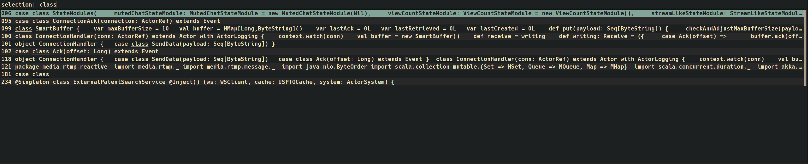

# roficlip
A simple shell script that surfaces clipboard history from clipster in Rofi



## Dependencies

- ```gawk``` - https://www.gnu.org/software/gawk/
- ```clipster``` - https://github.com/mrichar1/clipster

## Running

    > ./roficlip
